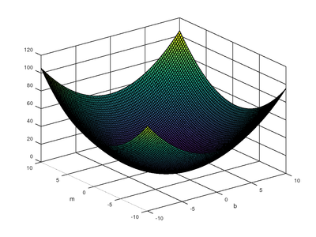
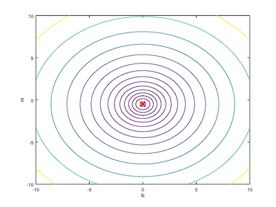

# GradientDescent
An example to demonstrate the application of the Gradient Descent Algorithm to univariate regression problems. 

|  | | |
|:---:|:---:|:---:|
| Cost Function: J(m,b) | Successive hypotheses (y = mx + b) after each iteration| Contours of J(m,b)|

### Dependencies
Numpy for computation and Matplotlib for visualization

### To Run
Simply invoke the python interpreter with the file `univariate.py` along with the optional argument of the path to a file containing a dataset of two comma-separated features. If no file is specified, the program will default to the dataset shown above. Note that sample datasets are located in the data directory.
  
example: `$ python univariate.py` or `$ python univariate.py file.csv`

### Normalization
Should you wish to normalize your dataset before running (probably a good idea), simply invoke the python interpreter with the file `normalize.py` along with the path to the dataset. Doing so will result in a file by the name of `filename_normalized.csv` which contains a normalized version of the data in `filename.csv`. 
