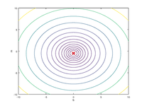

# GradientDescent
An example to demonstrate the application of the Gradient Descent Algorithm in univariate regression problems. 

|  | | |
|:---:|:---:|:---:|
| Cost Function: J(m,b) | Successive lines of "best" fit| Contours of J(m,b)|
